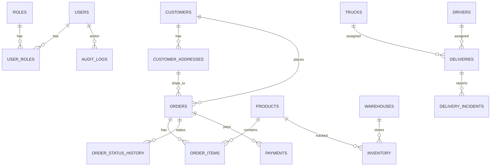

# Modelo entidad-relación (ERD)

## Entidades clave
- `orders`: núcleo del flujo operativo.
- `inventory` y `inventory_movements`: control de stock.
- `deliveries`: seguimiento de entregas e incidencias.
