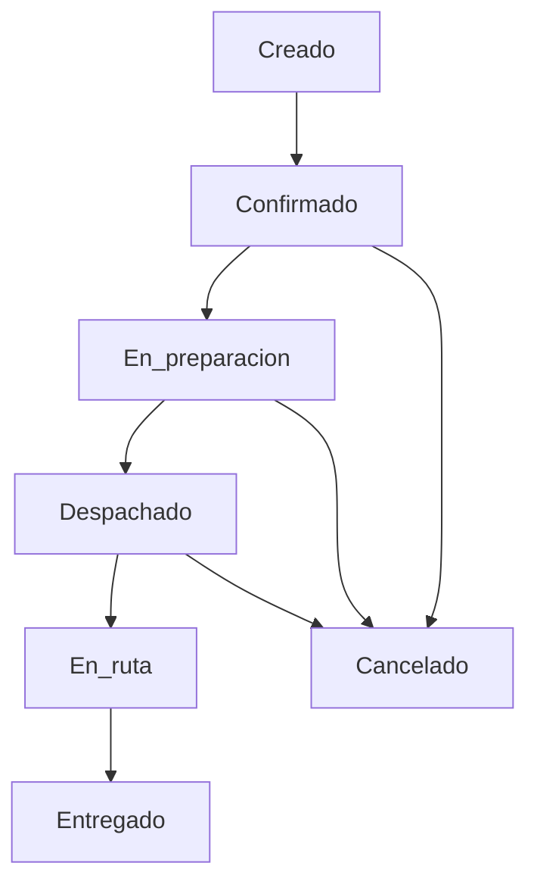

# Diagrama de flujo de pedidos

## Descripción
- El pedido se crea en call center con cliente, dirección y productos.
- El supervisor confirma disponibilidad y despacho.
- El almacén prepara el pedido y se genera salida de inventario.
- Logística asigna camión y repartidor.
- Repartidor confirma entrega o reporta incidencia.
